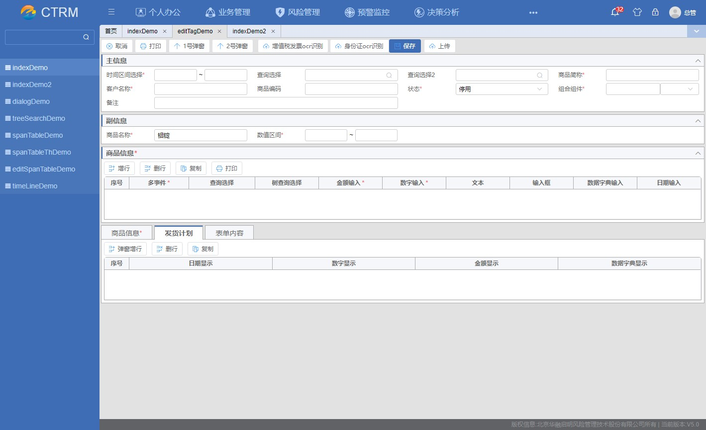

# QmEdit 组件

## 组件引入

> template 下直接引入组件

```html
<qm-edit
  ref="qmEdit"
  :edit="edit"
  @closeDialog="handleCloseDialog"
  @closeLv2Dialog="handleCloseLv2Dialog"
></qm-edit>
```

## 属性说明

| 属性名 | 类型   | 默认值 | 说明                   |
| :----: | :----- | :----- | ---------------------- |
|  edit  | Object | -      | 索引列表需要的数据对象 |

## edit 数据格式说明

```javascript
data(){
    return{
        edit:{
            type:'',
            param:'',
            mode:'',
            api:{},
            apiData:{},
            topButtons:[],
            formData:{},
            tables:{},
            tabs:[]
        }
    }
}

```

## edit 属性说明

|   属性名   | 类型         | 默认值 | 说明                                                       | 可选值                                      |
| :--------: | :----------- | :----- | ---------------------------------------------------------- | ------------------------------------------- |
|    type    | string       | view   | 页面类型                                                   | add/view/assist/audit/update                |
|   param    | string       | -      | 页面接收参数                                               |                                             |
|    mode    | string       | route  | 编辑页启动方式                                             | route/dialog                                |
|    api     | object       |        | 页面对应 API                                               | [api 属性说明](#api-属性说明)               |
|  apiData   | object       |        | 页面对应 API 传参                                          |                                             |
| extraParam | string       | -      | 打开弹窗额外参数传入                                       |                                             |
| topButtons | array        |        | 顶部按钮数据                                               | [topButtons 属性说明](#topButtons-属性说明) |
|  formData  | object,Array |        | 主信息数据(若只存在一个主信息则 formData 的值可接受 Array) | [formData 属性说明](#formData-属性说明)     |
|   tables   | Array        | -      | 编辑页 table 表格数据(通栏)                                | [tables 属性说明](#tables-属性说明)         |
| tablesTwo  | Array        | -      | 编辑页 table 表格数据 （左右分栏）                         | [tablesTwo 属性说明](#tablesTwo-属性说明)   |
|    tabs    | Array        | -      | 编辑页 Tabs 标签页表格数据                                 | [tabs 属性说明](#tabs-属性说明)             |

## api 属性说明

```javascript
 api: {
    view: '/get',
    save: '/save',
    update: '/update',
    pre: {
        CUST_INFO: '/api/cust/customer/getByCode'
    },
},
```

|  属性名  |     类型      | 说明                                                   |
| :------: | :-----------: | :----------------------------------------------------- |
|   view   |    string     | 获取页面初始化数据                                     |
|   save   |    string     | 页面保存数据 api(type="add")时启用                     |
|  update  |    string     | 页面保存数据 api(type="update")时启用 ，为默认保存 api |
| complete |    string     | 页面保存数据 api(type="complete")时启用                |
|   pre    | string,object | 获取上级单据                                           |

## topButtons 属性说明

```javascript
 topButtons: [
    {
        iconName: '线性-提交',
        name: '2号弹窗',
        event: 'set',
        isShow: ['add', 'update'],
        component: () => import('@/views/example/indexDemo/productSelect.vue'), // 组件
        validate: this.validateEvent, // 验证
        setDefault: this.doSet, // 设置默认值
        beforeCallback: this.closeCallbackValidate, // 关闭弹窗之前的验证 return true or false
        callback: this.closeCallback ,// 关闭弹窗回调
        attrs: {
            type: 'primary'
        },
        extraEvent: this.save,
        showAttachment: true, // 是否在新增保存后打开附件上传弹窗
    },
],
```

|     属性名     | 类型     | 默认  | 说明                                    |
| :------------: | :------- | :---: | --------------------------------------- |
|      type      | string   |   -   | 按钮类型                                |
|    iconName    | string   |   -   | 按钮图标名称                            |
|   permitName   | string   |   -   | 操作权限                                |
|      name      | string   |   -   | 按钮名称                                |
|     event      | string   |   -   | 按钮点击事件                            |
|     isShow     | array    |       | 按钮是否显示()                          |
|    callback    | string   |   -   | 关闭弹窗回调                            |
|     attrs      | string   |   -   | [按钮属性](#attrs-按钮属性说明)         |
|   component    | function |   -   | 按钮弹窗组件引用                        |
|    validate    | function |   -   | 按钮做相应验证                          |
|   setDefault   | function |   -   | 设置打开弹窗默认值                      |
| beforeCallback | function |       | 关闭弹窗之前的验证 return true or false |
|   extraEvent   | function |       | 自定义保存事件                          |
| showAttachment | Boolean  |   -   | 是否在新增保存后打开附件上传弹窗        |
|  showLoading   | boolean  | false | 是否加载中状态                          |

## attrs 按钮属性说明

```javascript
atrrs: {
    type:'primary'
    uploadUrl: process.env.BASE_API + '/api/ocr/intsig/recognize',
    showFileList: false,
    accept: 'image/*',
    multiple: false,
    disabled: false,
    notifyFlag: true,
    paramData: { type: 'vat_invoice' },
    beforeUploadCallback: this.vatInvoiceOcrBeforeUploadCallback, // 文件上传前回调
    progressCallback: this.vatInvoiceOcrProgressCallback, // 文件上传时回调
    successCallback: this.vatInvoiceOcrSuccessCallback, // 文件上传成功回调
    errorCallback: this.vatInvoiceOcrErrorCallback, // 文件上传错误回调
    changeCallback: this.vatInvoiceOcrChangeCallback // 文件状态改变回调
}
```

|        属性名        | 类型     |        默认        | 说明                                       | 可选值            |
| :------------------: | :------- | :----------------: | ------------------------------------------ | ----------------- |
|         type         | string   |         -          | 按钮类型 默认不添加 type，默认状态下的按钮 | primary(选中状态) |
|       disabled       | Boolean  |       false        | 是否禁用状态                               |                   |
|      uploadUrl       | string   |         -          | 文件上传 url ( type: 'upload'时启用)       |
|     showFileList     | Boolean  |       false        | 是否展示上传文件 ( type: 'upload'时启用)   |
|        accept        | string   | 默认\*，即所有文件 | 文件类型 ( type: 'upload'时启用)           |
|       multiple       | Boolean  |       false        | 是否可选择多文件 ( type: 'upload'时启用)   |
|       disabled       | Boolean  |       false        | 是否不可操作 ( type: 'upload'时启用)       |
|      notifyFlag      | Boolean  |        true        | 是否弹出通知 ( type: 'upload'时启用)       |
|      paramData       | object   |         {}         | 参数数据 ( type: 'upload'时启用)           |
| beforeUploadCallback | function |         -          | 文件上传前回调 ( type: 'upload'时启用)     |
|   progressCallback   | function |         -          | 文件上传时回调 ( type: 'upload'时启用)     |
|   successCallback    | function |         -          | 文件上传成功回调 ( type: 'upload'时启用)   |
|    errorCallback     | function |         -          | 文件上传错误回调 ( type: 'upload'时启用)   |
|    changeCallback    | function |         -          | 文件状态改变回调 ( type: 'upload'时启用)   |

## formData 属性说明

> 若只存在一个主信息则 formData 的值可接受 Array

```javascript
formData:{
    part1:{
        dtoKey: 'product',
        visible：true,
        hidden: false, // 若为true则隐藏该部分
        titleName: '主信息',
        content:[]
    },
    part2:{}
    ...
}
```

|  属性名   | 类型    | 默认  | 说明                                                    | 可选值 |
| :-------: | :------ | :---: | ------------------------------------------------------- | ------ |
| titleName | string  |   -   | 页面区域标题                                            |        |
|  visible  | Boolean | true  | 页面区域是否展开                                        |        |
|  dtoKey   | object  |   -   | 表单数据对象                                            |        |
|  hidden   | Boolean | false | 是否隐藏该部分                                          |        |
|  content  | array   |   -   | 内容数据 [content 属性说明](#formData.content-属性说明) |        |

## formData.content 属性说明

```javascript
content:[
    {
        type: '',
        label: '',
        props: '',
        default:''
        element: 'base-dialog-select',
        attrs: {
            clearable: true,
            format: 'yyyy-MM-dd',
            'value-format': 'yyyyMMdd'
        },
        component: () => import('@/views/example/indexDemo/productSelect.vue'),
        list: this.$t('datadict.usingFlag')
        validate: [
            {
                required: true,
                trigger: 'change'
            }
        ],
        callback:this.secondCloseCallback,
        event:{
            change: this.onChange,
            evn: this.onEvn,
            changeAll: this.onChangeAll

        },
    },
]

```

|  属性名   | 类型          |   默认   | 说明                                        | 可选值                                                         |
| :-------: | :------------ | :------: | ------------------------------------------- | -------------------------------------------------------------- |
|   type    | string        | 下拉输入 | 输入框类型                                  | date/radio/checkbox/numberInterval(数值区间)/combine(组合组件) |
|   props   | string/object |    -     | 输入框属性，type:'date' 时 props 类型为数组 |                                                                |
|   label   | string        |    -     | 输入框文本                                  |                                                                |
|  default  | string        |    -     | 输入框默认输入文本                          |                                                                |
|  element  | string/object |    -     | 输入框类型 _同 QmFrom 下 element_           |                                                                |
|   attrs   | object        |    -     | 输入框属性 _同 QmFrom 下 attrs_             |                                                                |
| component | function      |    -     | 输入框弹出弹窗的组件                        | element 为 base-dialog-selects 时启用                          |
|   list    | array         |    -     | 输入框下拉数组数据                          | element 为 base-selects 时启用                                 |
| validate  | object        |    -     | 输入框验证                                  |                                                                |
| callback  | function      |    -     | 输入框回调函数                              |                                                                |
|   event   | function      |    -     | 输入框自定义事件 \_同 QmFrom 下 event       |                                                                |

## formData.content.element 属性说明

|       属性名        | 说明         |
| :-----------------: | :----------- |
| base-dialog-selects | 弹窗输入框   |
|    base-selects     | 下拉选输入框 |
|   input-validate    | 文本输入框   |
|      el-input       | 普通输入框   |

## tables 属性说明

```javascript
tables: [
            {
                name: 'DEMO_Tab11',
                label: '商品信息',
                component: () => import('./DEMO_Tab.vue'),
                isShow: ['add', 'update'],
                required: true
            },
            {
                name: 'DEMO_Tab22',
                label: '发货计划',
                component: () => import('./DEMO_Tab2.vue'),
                isShow: ['view'],
                visible
            }
        ],

```

|   属性名   | 类型          | 默认 | 说明                 | 可选值 |
| :--------: | :------------ | :--: | -------------------- | ------ |
|    name    | string        |      | 标题属性             |        |
|   label    | string        |      | 标题名称             |        |
| component  | function      |      | table 内容组件       |        |
|   isShow   | array/Boolean |      | 是否显示             |        |
|  required  | Boolean       |      | 是否必填             |        |
|  visible   | string        |      | table 是否展开       |        |
| extraParam | object        |      | 打开弹窗额外参数传入 |

## tabs 属性说明

```javascript
tabs: [
  {
    name: "DEMO_Tab",
    label: "商品信息",
    component: () => import("./DEMO_Tab.vue"),
    isShow: ["add", "update"],
    required: true,
  },
  {
    name: "DEMO_Tab2",
    label: "发货计划",
    component: () => import("./DEMO_Tab2.vue"),
    isShow: ["add", "update"],
  },
  {
    name: "DEMO_Tab3",
    label: "表单内容",
    component: () => import("./DEMO_Tab3.vue"),
  },
];
```

|  属性名   | 类型          | 默认 | 说明                                              | 可选值 |
| :-------: | :------------ | :--: | ------------------------------------------------- | ------ |
|   name    | string        |      | 与选项卡绑定值 value 对应的标识符，表示选项卡别名 |        |
|   label   | string        |      | 选项卡标题                                        |        |
| component | function      |      | 选项卡内容组件                                    |        |
|  isShow   | array/Boolean |      | 是否显示                                          |        |
| required  | Boolean       |      | 是否必填                                          |        |

## 事件

|    事件名称    | 说明                                              | 回调参数   |
| :------------: | ------------------------------------------------- | ---------- |
|  closeDialog   | 关闭当前页面或弹窗                                | --         |
| closeLv2Dialog | 二级弹窗关闭回调                                  | --         |
|  initCallback  | 初始化数据回调 （页面类型为查看或者修改时可调用） | 初始化数据 |
|  preCallback   | 上级数据查询返回（api.pre）                       | 上级数据   |

## 示例代码


