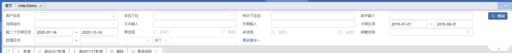

# QmForm 组件

## 组件引入

> template 下直接引入组件

```html
<qm-form ref="qmForm" :form="form"></qm-form>
```

## 属性说明

| 属性名 | 类型   | 默认值 | 说明                   |
| :----: | :----- | :----- | ---------------------- |
|  form  | Object | -      | 索引列表需要的数据对象 |

## form 数据格式说明

```javascript
data(){
    return{
        form:{
            listQuery:{
                data:{
                    customerCode:'' //查询列表的所有属性
                }
               moreShowFlg: true, // 是否显示更多查询，默认false
                formData:[
                   {
                     //查询列表下各项查询框
                   },
                   {
                     //查询列表下各项查询框
                   },
                ]
            }
        }
    }
}

```

## formData 属性说明

|  属性名   | 类型         | 默认值   | 说明                       | 可选值                                                                                  |
| :-------: | :----------- | :------- | -------------------------- | --------------------------------------------------------------------------------------- |
|   type    | string       | 输入框   | 输入框类型                 | daterange/date/year/month/week/radio/checkbox/numberInterval                            |
|   lable   | string       | -        | 输入框关联的 label 文字    |
|   prop    | string       | -        | 输入框绑定值               |
|   props   | array        | -        | 输入框区间绑定值           |
|  element  | string       | el-input | 输入框类型                 | input-validate / base-select / base-dialog-select [element 属性说明](#element-属性说明) |
|   attrs   | Object       | -        | 输入框属性                 | [attrs 属性说明](#attrs-属性说明)                                                       |
|   event   | Object       | -        | 输入框事件                 | [event](#event-方法) 可自定义事件                                                       |
|   list    | array        | -        | 输入框下拉数组 label/value |
|  default  | string/array | -        | 输入框默认值               |
| component | string       | -        | 输入框弹出弹窗所对应的组件 |

## element 属性说明

|       属性名       | 说明         |
| :----------------: | ------------ |
|      el-input      | 输入框       |
|    base-select     | 下拉选输入框 |
| base-dialog-select | 弹窗选择框   |
|   input-validate   | 输入框       |

## attrs 属性说明

|    属性名     | 类型    | 默认  | 说明                                                                |
| :-----------: | :------ | :---: | ------------------------------------------------------------------- |
|   clearable   | Boolean | false | 是否可清空                                                          |
|    format     | string  |   -   | 显示在输入框中的格式 yyyy-MM-dd                                     |
| value-format  | string  |   -   | 绑定值的格式                                                        |
|   disabled    | boolean | false | 是否禁用                                                            |
|     data      | string  |   -   | 统一基础档案组件，传值 data 区分                                    |
|    params     | string  |   -   | 传值参数                                                            |
|      min      | number  |   -   | 设置最小值                                                          |
|      max      | number  |   -   | 设置最大值                                                          |
|   precision   | number  |   -   | 保留小数位数                                                        |
| canChangeList | Boolean | true  | 若远程查询则设为 false                                              |
| labelShowCode | Boolean | false | 下拉选是否展示 code 值                                              |
|   component   | string  |   -   | 输入框弹出弹窗所对应的组件                                          |
| showMoreList  | Boolean | false | 模糊查询是否显示更多的值 ,对应显示条数 对应 params 下的 size 属性值 |
|   multiple    | Boolean | false | 是否多选                                                            |
|   pickStart   | string  |   -   | 日期区间开始时间变化                                                |
|    pickEnd    | string  |   -   | 日期区间结束时间变化                                                |
|   startMin    | number  |   -   | 数值区间设置起始值最小值                                            |
|   startMax    | number  |   -   | 数值区间设置起始值最大值                                            |
|    endMin     | number  |   -   | 数值区间设置结束值最小值                                            |
|    endMax     | number  |   -   | 数值区间设置结束值最大值                                            |

## event 方法

|  方法名   | 说明                 | 回调参数       |
| :-------: | -------------------- | -------------- |
|  change   | 选中值发生变化时触发 | 目前的选中值   |
|    evn    | 选中值发生变化时触发 | 目前的选中值   |
| changeAll | 选中值发生变化时触发 | 目前的选中对象 |

## 示例代码



```javascript
        form: {
                listQuery: {
                    isPage: true,
                    current: 1,
                    size: 20,
                    funcModule: this.$t('route.' + this.$route.meta.title),
                    funcOperation: this.$t('biz.btn.search'),
                    data: {
                        customerCode: '',
                        multipleSelect: [],
                        organCode: '',
                        productCategoryCode: '',
                        selectComponent: '',
                        remark: '',
                        date: '',
                        createDateStart: '',
                        createDateEnd: '',
                        radio: '1',
                        checkbox: [],
                        dialogSelect: ''
                    },
                    sortString: 'productCode.asc'
                },

                moreShowFlg: true,

                formData: [
                    {
                        label: '客户名称',
                        prop: 'customerCode',
                        element: 'base-select',
                        attrs: {
                            data: 'CUST_INFO', // 统一基础档案组件，传值data区分
                            clearable: true,
                            params: {
                                size: 5,
                                typeCode: '4' // 不写:所有客户供应商经济商仓储公司， '1'只显示客户，'2'只显示供应商，
                            },
                            canChangeList: false, // 若远程查询则设为false
                            labelShowCode: true,
                            component: () => import('@/views/example/indexDemo/productSelect.vue'),
                            showMoreList: true
                        },
                        event: {
                            change: this.onChange,
                            evn: this.onEvn,
                            changeAll: this.onChangeAll
                        },
                        list: []
                    },
                    {
                        label: '多选下拉',
                        prop: 'multipleSelect',
                        element: 'base-select',
                        list: this.$t('datadict.usingFlag'),
                        attrs: {
                            clearable: true,
                            multiple: true
                        }
                    },
                    {
                        label: '树状下拉选',
                        prop: 'organCode',
                        element: 'base-select',
                        attrs: {
                            // 各种配置详情看ElTreeSelect公共组件
                            data: 'TREE_ORGAN',
                            clearable: true
                        },
                        event: {
                            evn: this.change, // 获取当前选中值
                            changeAll: this.changeAll // 获取当前选中对象
                        }
                    },
                    {
                        label: '数字输入',
                        prop: 'productCategoryCode',
                        element: 'input-formatter',
                        attrs: {
                            min: 0,
                            max: 999999999999.999,
                            type: 'thousands',
                            precision: 3
                        }
                    },
                    {
                        label: '选择组件',
                        prop: 'selectComponent',
                        element: 'base-select',
                        list: this.$t('datadict.usingFlag'),
                        attrs: {
                            clearable: true
                        }
                    },
                    {
                        label: '文本输入',
                        prop: 'remark',
                        element: 'el-input',
                        attrs: {
                            clearable: true
                        }
                    },
                    {
                        type: 'date',
                        label: '日期输入',
                        prop: 'date',
                        attrs: {
                            clearable: true,
                            format: 'yyyy-MM-dd',
                            'value-format': 'yyyyMMdd'
                        }
                    },
                    {
                        type: 'date',
                        label: '日期区间',
                        props: ['createDateStart', 'createDateEnd'],
                        attrs: {
                            format: 'yyyy-MM-dd',
                            'value-format': 'yyyyMMdd'
                        },
                        default: ['20190701', '20190801']
                    },
                    {
                        type: 'date',
                        label: '第二个日期区间',
                        props: ['createDateStartLv2', 'createDateEndLv2'],
                        attrs: {
                            pickStart: 'dateStartBeforeLv2',
                            pickEnd: 'dateEndBeforeLv2',
                            format: 'yyyy-MM-dd',
                            'value-format': 'yyyyMMdd'
                        }
                    },
                    {
                        type: 'radio',
                        label: '单选框',
                        prop: 'radio',
                        list: [
                            {
                                label: '选项1',
                                value: '1'
                            },
                            {
                                label: '选项2',
                                value: '2'
                            }
                        ],
                        attrs: {
                            disabled: true
                        }
                    },
                    {
                        type: 'checkbox',
                        label: '多选框',
                        prop: 'checkbox',
                        list: [
                            {
                                label: '选项1',
                                value: '1'
                            },
                            {
                                label: '选项2',
                                value: '2'
                            }
                        ],
                        attrs: {
                            disabled: true
                        }
                    },
                    {
                        label: '弹窗选择',
                        prop: 'dialogSelect',
                        element: 'base-dialog-select',
                        component: () => import('@/views/example/indexDemo/productSelect.vue'),
                        attrs: {
                            data: '批次弹窗选择',
                            clearable: true
                        }
                    },
                    {
                        type: 'numberInterval',
                        label: '数值区间',
                        props: ['startValue', 'endValue'],
                        attrs: {
                            startMin: 0,
                            startMax: 999999999999.99,
                            endMin: 0,
                            endMax: 999999999999.99,
                            type: 'thousands',
                            precision: 3
                        }
                    }
                ]
            },
```
