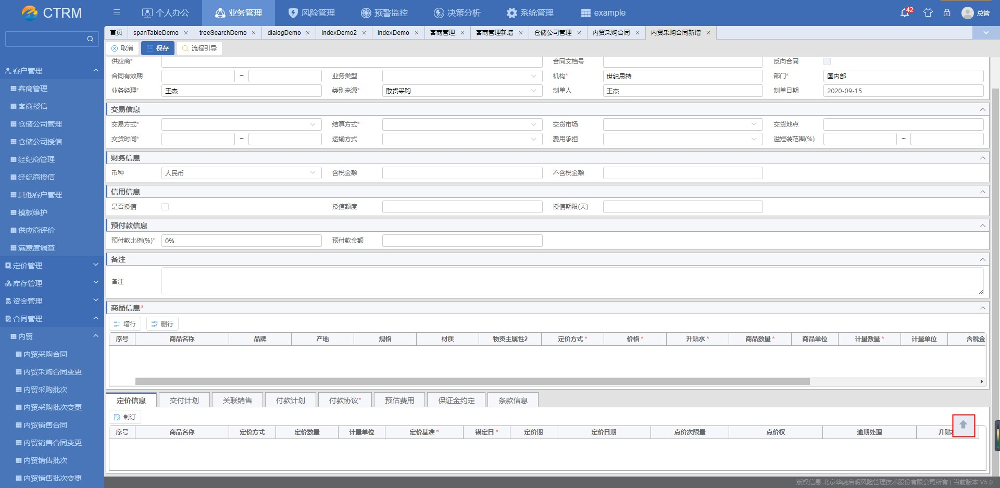

# 回到顶部按钮

> template 下引入组件

```html
<template>
  <backToTop v-show="showBackToTop" :dom="$refs.appMain"></backToTop>
</template>
<script>
  import backToTop from "@/components/frame/BackToTop";
  components: {
    backToTop,
  },
</script>
```

## 属性说明

|     属性名     | 类型   | 默认值 | 说明                      |
| :------------: | :----- | :----- | ------------------------- |
|  customStyle   | Object | 见下表 | 头部名称                  |
| transitionName | String | fade   | 用于自动生成 CSS 过渡类名 |
|      dom       | String | window | 当前实例对象              |


