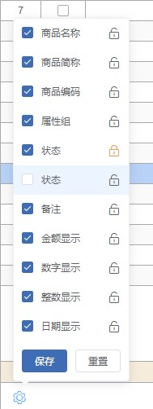

# 列设置

> table 表格列设置

## 组件使用

> template 下直接引入组件

```html
<el-table-column-set
  :id="mainData.table.id"
  :checked="checked"
  :checkList="tableCols"
  @change="checkChange"
  @lockEvent="handleLockChange"
></el-table-column-set>
```

## 属性说明

|   参数    | 说明                 | 类型   | 可选值 | 默认值 |
| :-------: | :------------------- | ------ | ------ | ------ |
|    id     | 当前 table 表格 id   | String | -      | -      |
|  checked  | 当前选中的列数据     | Array  | -      | -      |
| checkList | 当前表格所有的列数据 | Array  | -      | -      |

# Event

| 事件名称  | 说明                   | 回调参数       |
| :-------: | :--------------------- | -------------- |
|  change   | 隐藏动画播放完毕后触发 | -              |
| lockEvent | 点击锁定按钮事件       | 当前锁定属性值 |


