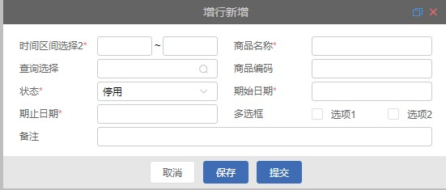

# 简单弹窗

## 组件引入

> 在 template 中使用

```html
<qm-dialog
  ref="qmDialog"
  :dialog="dialog"
  @closeDialog="handleCloseDialog"
></qm-dialog>
```

## 属性说明

| 属性名 | 类型   | 默认值 | 说明     |
| :----: | :----- | :----- | -------- |
| dialog | obiect | -      | 弹窗数据 |

## dialog 属性说明

```javascript
export default {
  data() {
    return {
      dialog: {
        type: "",
        param: "",
        styleType: "",
        titleName: "",
        initChooseParam:{}
        initType:''
        api: {},
        apiData:{}
        formData: [],
        bottomButtons: [],
      },
    };
  },
};
```

|     属性名      | 类型   | 默认值 | 说明                                                                         |
| :-------------: | :----- | :----- | ---------------------------------------------------------------------------- |
|      type       | string | add    | 弹窗类型                                                                     |
|      param      | object | -      | 弹窗传入参数                                                                 |
|    styleType    | string | -      | 弹窗尺寸选择 mini/medium/max                                                 |
|    titleName    | string | -      | 弹窗标题名称                                                                 |
| initChooseParam | object | -      | 弹窗初始化参数                                                               |
|    initType     | string | -      | 初始化类型 initType:'api' 或者 'param'                                       |
|       api       | object | -      | 所需 api [api 数据说明](#api-数据说明)                                       |
|     apiData     | object | -      | api 携带参数                                                                 |
|    formData     | array  | -      | 弹窗查询区域，属性详情见[QmForm 中 formData](pages/QmForm#formdata-属性说明) |
|  bottomButtons  | array  | -      | 弹窗底部按钮数组 [bottomButtons 数据说明](#bottomButtons-数据说明)           |

## api 数据说明

| 属性名 | 说明 |
| :----: | ---- |
|  view  | 查看 |
|  save  | 保存 |
| update | 修改 |

```javascript
 api: {
    view: '/api/data/ddFuturesPrice/get',
    save: '/api/data/ddFuturesPrice/save',
    update: '/api/data/ddFuturesPrice/update'
    },
```

## bottomButtons 数据说明

```javascript
 bottomButtons: [
          {
            iconName: '线性-关闭',
            name: 'biz.btn.close',
            event: 'close',
            isShow: ['view'],
            attrs: {
              type: 'primary'
            }
          },
          {
            iconName: '线性-取消',
            name: 'biz.btn.cancel',
            event: 'cancel',
            isShow: ['add', 'update']
          },
          {
            name: 'biz.btn.save',
            iconName: '线性-保存',
            event: 'save',
            showLoading: true,
            isShow: ['add', 'update'],
            attrs: {
              type: 'primary'
            }
          }
        ]
      }
```

|   属性名    | 类型     | 说明                                      | 默认  |
| :---------: | -------- | ----------------------------------------- | ----- |
|  iconName   | string   | 按钮图标名称                              | -     |
|    name     | string   | 按钮名称                                  | -     |
|    event    | function | 按钮点击事件                              | -     |
| showLoading | boolean  | 是否加载中状态                            | false |
|   isShow    | array    | 是否显示按钮                              | -     |
|    attrs    | object   | 按钮属性[attrs 属性说明](#attrs-属性说明) | -     |

## attrs 属性说明

|  属性名  | 类型    | 说明                           | 默认       |
| :------: | ------- | ------------------------------ | ---------- |
|   type   | string  | 按钮样式类型 primary(选择状态) | 未选中状态 |
| disabled | boolean | 是否禁用按钮                   | false      |
|   icon   | string  | 图标类名                       | -          |

## 事件

|  事件名称   | 说明     | 回调 |
| :---------: | :------- | ---- |
| closeDialog | 关闭弹窗 |      |



```

```
