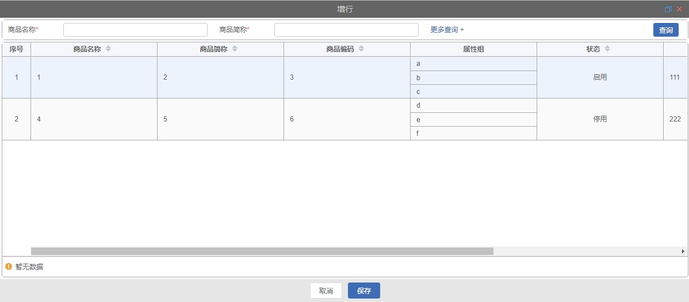

# 合并弹窗

## 组件引用

> template 下直接引入组件

```html
<qm-dialog-array-table
  ref="qmDialogArray"
  :dialog="dialog"
  @closeDialog="handleCloseDialog"
></qm-dialog-array-table>
```

## 属性说明

| 属性名 | 类型   | 默认值 | 说明     |
| :----: | :----- | :----- | -------- |
| dialog | obiect | -      | 弹窗数据 |

## dialog 属性说明

```javascript
export default {
  data() {
    return {
      dialog: {
        titleName: "",
        moreShowFlg: "",
        initChooseParam: {},
        formData: [],
        mainData: {},
        bottomBar: {},
        bottomButtons: [],
      },
    };
  },
};
```

|     属性名      | 类型    | 默认值 | 说明                                                                                     |
| :-------------: | :------ | :----- | ---------------------------------------------------------------------------------------- |
|    titleName    | string  | -      | 弹窗标题名称                                                                             |
|   moreShowFlg   | boolean | false  | 是否显示更让查询                                                                         |
| initChooseParam | object  | false  | 查询默认条件参数                                                                         |
|    formData     | array   | -      | 弹窗查询区域，属性详情见[QmForm 中 formData](pages/QmForm#formdata-属性说明)             |
|    mainData     | object  | -      | 弹出 table 表格区域[mainData 数据说明](#mainData-数据说明)                               |
|    bottomBar    | array   | -      | 弹窗 table 表格下方底部按钮及分页部分 [bottomBar 数据说明](#bottomBar-数据说明)          |
|  bottomButtons  | array   | -      | 弹窗底部按钮数组 [简单弹窗 bottomButtons 数据说明](page/QmDialog#bottomButtons-数据说明) |

## mainData 数据说明

```javascript
 mainData: {
        initSearch: false,
        api: {
            search: '/api/dd/productCategory/list'
        },
        apiData: {
            search(defaultParams) {
                return {
                    ...defaultParams,
                    hideOptions: '123'
                }
            }
        },
        table: {
            showCheckbox: false,
            sortable: true,
            mergeProp: 'invCommodityDto',
            cols: []
        }
    },
```

|   属性名   | 类型    | 默认值 | 说明                                                  |
| :--------: | :------ | :----- | ----------------------------------------------------- |
| initSearch | boolean | -      | 初始化是否查询默认条件下数据                          |
|    api     | object  | -      | table 数据查询 api api: { search: ''},                |
|  apiData   | object  | false  | 查询默认条件参数                                      |
|   table    | object  | -      | 表格数据，属性详情见[table 属性说明](#table-属性说明) |

## table 数据说明

```javascript
table: {
    showCheckbox: false,
    sortable: true,
    mergeProp: 'invCommodityDto',
    cols:[]
}
```

|    属性名    | 类型    | 默认值 | 说明                                                        |
| :----------: | :------ | :----- | ----------------------------------------------------------- |
| showCheckbox | boolean | false  | 是否显示多选框                                              |
|   sortable   | boolean | false  | 对应列是否可以排序，设置为 'custom'，则代表用户希望远程排序 |
|  mergeProp   | string  | -      | 指定对应列合并数组                                          |
|     cols     | array   | -      | 表格列数据数组 [cols 属性说明](#cols-属性说明)              |

## cols 数据说明

```javascript
cols: [
  {
    prop: "attrGroupId",
    width: "220",
    label: "属性组",
    isSon: true,
  },
  {
    prop: "usingFlag",
    width: "220",
    align: "center",
    label: "状态",
    format: {
      dict: this.$t("datadict.usingFlag"),
    },
  },
  {
    prop: "remark",
    minWidth: "500",
    label: "备注",
  },
];
```

|  属性名  | 类型    | 默认值 | 说明               |
| :------: | :------ | :----- | ------------------ |
|   prop   | string  | -      | 对应列内容的字段名 |
|  width   | string  | -      | 对应列宽度         |
| minWidth | string  | -      | 对应列最小宽度     |
|  label   | string  | -      | 对应列名称         |
|  isSon   | boolean | false  | 是否显示合并行     |
|  isShow  | boolean | false  | 是否显示对应列     |
|  isSlot  | boolean | false  | 是否显示自定义内容 |
|  format  | object  | -      | 对应列内容格式化   |
| sortable | object  | -      | 对应列是否可以排序 |

## bottomBar 数据说明

```javascript
    bottomBar: {
        // 分页数据
        pagination: {
            show: true,
            layout: 'total, sizes, prev, pager, next, jumper',
            pageSizes: [20, 40, 60, 80, 100]
        }
    },
```

> pagination 为分页数据。属性详情如下：

|  属性名   | 类型     | 默认值                                 | 说明                         |
| :-------: | :------- | :------------------------------------- | ---------------------------- |
|   show    | boolean  | false                                  | 是否显示分页                 |
|  layout   | string   | 'prev, pager, next, jumper, ->, total' | 组件布局，子组件名用逗号分隔 |
| pageSizes | number[] | [10, 20, 30, 40, 50, 100]              | 每页显示个数选择器的选项设置 |

## 方法

|    方法     | 说明         | 回调函数 |
| :---------: | :----------- | :------- |
| closeDialog | 关闭弹窗回调 | -        |


