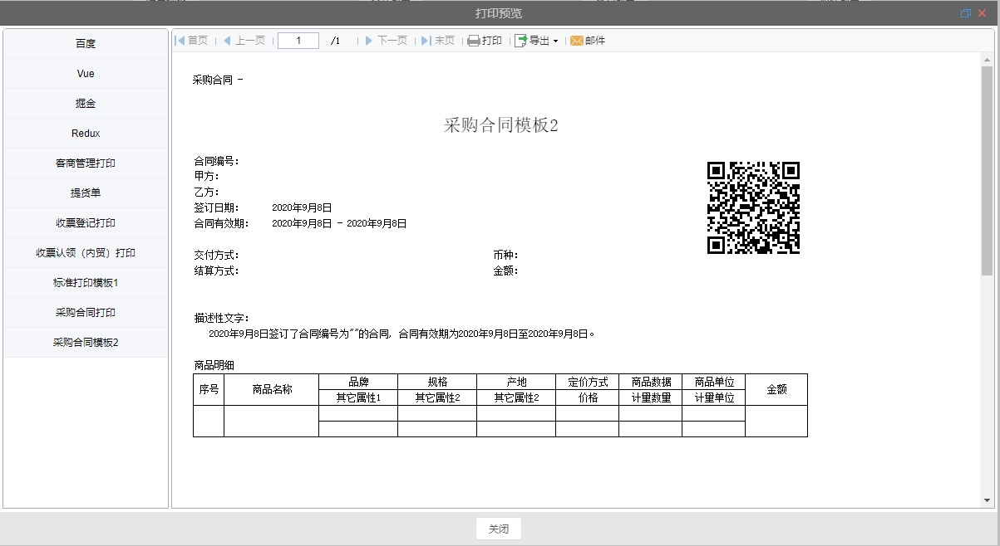

# iframe 查询弹窗

## 组件引入

> 在 template 中使用

```html
<qm-dialog-print
  :list="items"
  :active="activeUrl"
  v-on="$listeners"
></qm-dialog-print>
```

## 属性说明

| 属性名 | 类型   | 默认值 | 说明                        |
| :----: | :----- | :----- | --------------------------- |
|  list  | array  | -      | 弹窗内容左侧选择目录        |
| active | string | -      | 弹窗内容右侧 ifram 连接 url |

## 示例

```vue
<template>
  <qm-dialog-print
    :list="items"
    :active="activeUrl"
    v-on="$listeners"
  ></qm-dialog-print>
</template>

<script>
export default {
  data() {
    return {
      activeUrl: "",
      items: [
        {
          name: "百度",
          url: "https://www.baidu.com",
        },
        {
          name: "Vue",
          url: "https://cn.vuejs.org/",
        },
        {
          name: "掘金",
          url: "https://juejin.im/",
        },
        {
          name: "Redux",
          url: "https://www.redux.org.cn/",
        },
      ],
    };
  },
};
</script>
```


