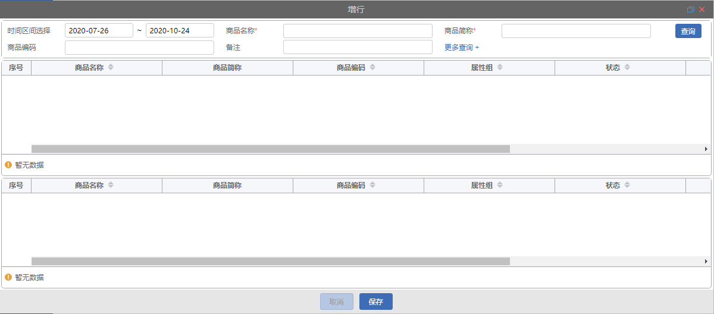

# 查询列表弹窗

## 组件引入

> 在 template 中使用

```html
<qm-dialog-table
  :dialog="dialog"
  @closeDialog="handleCloseDialog"
></qm-dialog-table>
```

## dialog 属性说明

```javascript
export default {
  data() {
    return {
      dialog: {
        titleName: "",
        moreShowFlg: true,
        formData: [],
        mainData: {},
        bottomBar: {},
        bottomButtons: [],
      },
    };
  },
};
```

|     属性名      | 类型    | 默认值 | 说明                                                                                                                              |
| :-------------: | :------ | :----- | --------------------------------------------------------------------------------------------------------------------------------- |
|    titleName    | string  | -      | 弹窗标题名称                                                                                                                      |
|   moreShowFlg   | boolean | false  | 是否显示更让查询                                                                                                                  |
| initChooseParam | object  | false  | 查询默认条件参数                                                                                                                  |
|    formData     | array   | -      | 弹窗查询区域，属性详情见[QmForm 中 formData](pages/QmForm#formdata-属性说明)                                                      |
|    mainData     | object  | -      | 弹出 table 表格区域，[mainData 数据说明](#mainData-数据说明)                                                                      |
|    bottomBar    | array   | -      | 弹窗 table 表格下方底部按钮及分页部分 属性详情见[合并弹窗 bottomBar 数据说明](pages/dialog/QmDialogArrayTable#bottomBar-数据说明) |
|  bottomButtons  | array   | -      | 弹窗底部按钮数组 属性详情见[简单弹窗的 bottomButtons 数据说明](page/QmDialog#bottomButtons-数据说明)                              |

## mainData 数据说明

```javascript
    mainData: {
        initSearch: false,
        api: {},
        apiData: {},
        table: {},
        linkTable: {}
    },
```

|   属性名   | 类型    | 默认值 | 说明                                                                                                     |
| :--------: | :------ | :----- | -------------------------------------------------------------------------------------------------------- |
| initSearch | boolean | -      | 初始化是否查询默认条件下数据                                                                             |
|    api     | object  | -      | table 数据查询 api api: { search: '',(table 表格数据查询 api)search_lv2:''(linkTable 表格数据查询 api)}, |
|  apiData   | object  | false  | 查询默认条件参数                                                                                         |
|   table    | object  | -      | 表格数据，属性详情见[table 属性说明](#table-属性说明)                                                    |
| linkTable  | object  | -      | 下表格数据，属性同 [table 属性说明](#table-属性说明)                                                     |

## table

```javascript
table:{
    selectionFixed:false,
    showCheckbox:false,
    cols:[]
}
```

|     属性名     | 类型            | 默认值 | 说明                                                                                    |
| :------------: | :-------------- | :----- | --------------------------------------------------------------------------------------- |
| selectionFixed | string, boolean | -      | 列是否固定在左侧或者右侧，true 表示固定在左侧, true, left, right                        |
|  showCheckbox  | boolean         | false  | 是否显示多选框                                                                          |
|    sortable    | boolean         | false  | 对应列是否可以排序，设置为 'custom'，则代表用户希望远程排序                             |
|      cols      | array           | -      | 表格列数据数组 属性详情见[cols 属性说明](pages/dialog/QmDialogArrayTable#cols-属性说明) |


