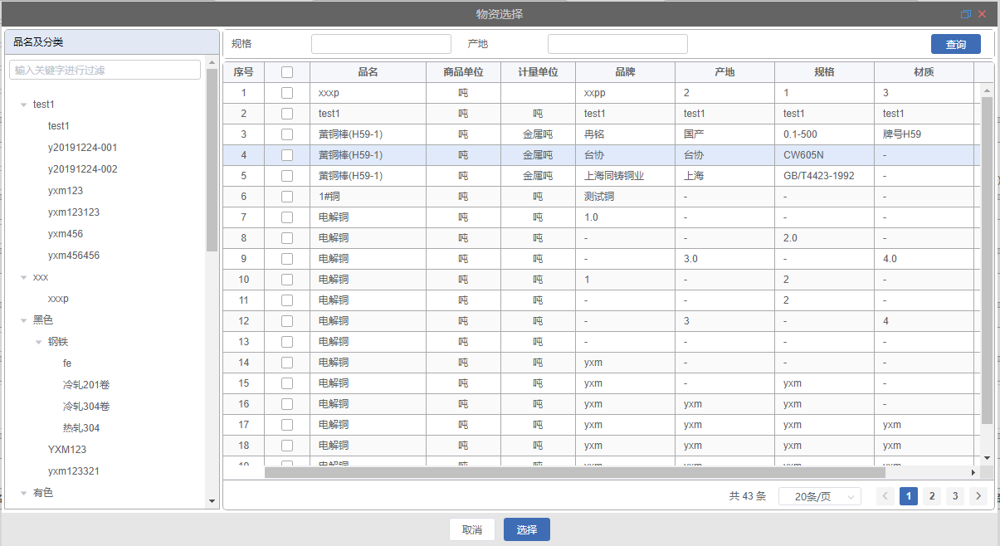

# 树状列表弹窗

## 组件引入

> 在 template 中使用

```html
<qm-dialog-tree-table
  :dialog="dialog"
  @closeDialog="handleCloseDialog"
></qm-dialog-tree-table>
```

## dialog 属性说明

```javascript
export default {
  data() {
    return {
      dialog: {
        titleName: "",
        form:{}
        mainData: [],
        bottomButtons: [],
      },
    };
  },
};
```

|    属性名     | 类型   | 默认值 | 说明                                                                                                 |
| :-----------: | :----- | :----- | ---------------------------------------------------------------------------------------------------- |
|   titleName   | string | -      | 弹窗标题名称                                                                                         |
|     form      | object | -      | 弹窗左侧内容及查询表单数据[form ](#form-属性说明)                                                    |
|   mainData    | array  | -      | 右侧列表数据数组[mainData ](#mainData-属性说明)                                                      |
| bottomButtons | array  | -      | 弹窗底部按钮数组 属性详情见[简单弹窗的 bottomButtons 数据说明](page/QmDialog#bottomButtons-数据说明) |

## form 数据说明

|        属性名         | 类型     | 默认值 | 说明                                                                                                                           |
| :-------------------: | :------- | :----- | ------------------------------------------------------------------------------------------------------------------------------ |
|       leftWidth       | number   |        | 左侧的宽度，默认不写为 200px                                                                                                   |
|       treeName        | string   |        | 左侧标题                                                                                                                       |
|       isTopBar        | Boolean  | false  | 左侧是否有顶部按钮                                                                                                             |
|        topBar         | array    |        | 左侧按钮组                                                                                                                     |
|       isSearch        | Boolean  | false  | 左侧是否有搜索框                                                                                                               |
|     showCheckbox      | Boolean  | false  | 节点是否可被选择                                                                                                               |
|       strictly        | Boolean  | false  | 在显示复选框的情况下，是否严格的遵循父子不互相关联的做法，默认为 false                                                         |
|     defaultProps      | object   | false  | 树节点默认属性 [defaultProps 数据说明](#defaultProps-数据说明)                                                                 |
|       expandAll       | Boolean  | false  | 是否默认展开所有节点                                                                                                           |
|   expandOnClickNode   | Boolean  | true   | 是否在点击节点的时候展开或者收缩节点 ，如果为 false，则只有点箭头图标的时候才会展开或者收缩节点。                              |
|    formDataVisible    | Boolean  | false  | 是否有查询部分                                                                                                                 |
|       formData        | Boolean  | false  | 查询部分数据 属性详情见[QmForm 中 formData](pages/QmForm#formdata-属性说明)                                                    |
|      initSearch       | Boolean  | false  | 初始化是否查询默认条件下的树状数据                                                                                             |
|          api          | object   | -      | 左侧树列表对应 api:{getTreeList:''// 获取树数据,getCheckedList:''//获取被选列表}                                               |
|        apiData        | object   | -      | 左侧树列表对应 api 参数                                                                                                        |
|       showCode        | Boolean  | -      | 树节点进行过滤时是否支持使用唯一标识进行过滤                                                                                   |
|    handleRowClick     | function | -      | 当某一行被点击时会触发该事件 参数 row, column, event                                                                           |
|   formSelectByTree    | Boolean  | -      | 是否为树节点查询                                                                                                               |
|   handleSearchClick   | function | -      | 左侧树列表查询事件                                                                                                             |
|    handleNodeClick    | function | -      | 左侧树列表点击事件                                                                                                             |
| handleTreeCheckChange | function | -      | 处理树形节点是否选中事件 回调参数（nodeData 节点数据，checked 是否被选中，chirdrenNodeChecked 节点的子树中是否有被选中的节点） |

## defaultProps 数据说明

```javascript
    defaultProps: {
        children: 'children',
        key: 'code',
        label: 'name'
    }
```

|  属性名  | 类型                         | 默认值 | 说明                                                 |
| :------: | :--------------------------- | :----- | ---------------------------------------------------- |
|   key    | string                       | -      | 每个树节点用来作为唯一标识的属性，整棵树应该是唯一的 |
| children | string                       | -      | 指定子树为节点对象的某个属性值                       |
|  label   | string, function(data, node) | -      | 指定节点标签为节点对象的某个属性值                   |

## mainData 数据说明

```javascript
mainData: {
  isTopBar：true,
  initSearch: true,
  api: {},
  apiData:{}
  table:{},
  bottomBar:{}
}
```

|   属性名   | 类型    | 默认值 | 说明                                                                                             |
| :--------: | :------ | :----- | ------------------------------------------------------------------------------------------------ |

| initSearch | Boolean | false  | 初始化是否查询默认条件下的列表数据                                                               |
|    api     | object  | -      | 右侧表格对应 api api:{search:''//列表数据请求}                                                   |
|  apiData   | object  | -      | 右侧表格对应 api 参数                                                                            |
|   table    | object  | -      | 右侧表格列表数据 参数详情见[QmDialogTable 下的 table 数据说明](pages/dialog/QmDialogTable#table) |
| bottomBar  | object  | -      | 右侧表格分页数据                                                                                 |

## 事件

|  事件名称   | 说明     | 回调 |
| :---------: | :------- | ---- |
| closeDialog | 关闭弹窗 |      |


