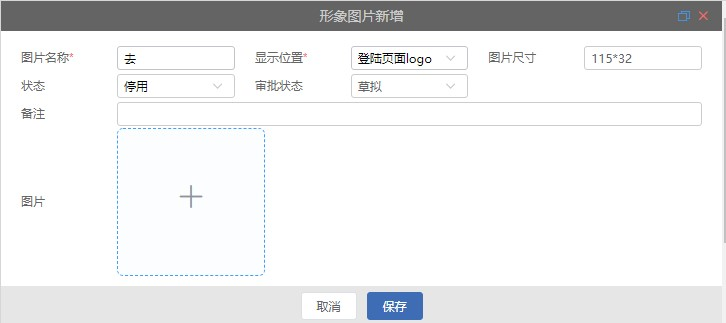

# 图片上传

> 通过点击或者拖拽上传文件

## 组件使用

```html
<image-upload
  v-model="formData.imagePath"
  :imgWidth="imgWidth"
  :imgHeight="imgHeight"
  :disabled="this.getDisabledView()"
  size="mini"
></image-upload>
```

## 属性说明

|    参数     | 说明                 | 类型    | 可选值     | 默认值                                          |
| :---------: | :------------------- | ------- | ---------- | ----------------------------------------------- |
|  uploadUrl  | 必选参数，上传的地址 | string  | -          | process.env.BASE_API + '/api/sys/file/uploadImg |
|   maxSize   | 上传图片的最大尺寸   | -       | -          | 2MB                                             |
|  disabled   | 是否禁用             | Boolean | false/true | false                                           |
|  imgWidth   | 图片列表宽度         | Number  | -          | -                                               |
|  imgHeight  | 图片列表高度         | Number  | -          | -                                               |
| httpHeaders | 设置上传的请求头部   | object  | -          | -                                               |
|  imageData  | 上传时附带的额外参数 | object  | -          | -                                               |

## Input Events

|   事件名称   | 说明               | 回调参数             |
| :----------: | :----------------- | -------------------- |
|    event     | 文件上传成功后函数 | 上传文件的路径       |
| onFileChange | 文件上传成功后函数 | 上传文件返回所有参数 |


