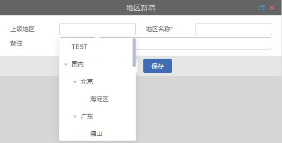

# 树形下拉

## 组件引入

```html
<el-tree-select
  :defaultProps="defaultProps"
  v-model="treeValue"
  :treeData="treeData"
  :clearable="clearable"
  :disabled="disabled"
  :defaultExpandAll="defaultExpandAll"
  :multiple="multiple"
  :selectCheck="selectCheck"
  :strictly="strictly"
  :nodeKey="nodeKey"
  :clickParent="true"
  @change="changeHandle"
  @changAll="changAllHandle"
></el-tree-select>
```

## 属性说明

|      属性名      | 类型           | 默认值 | 说明                                  |
| :--------------: | :------------- | :----- | ------------------------------------- |
|   defaultProps   | object         | -      | 配置选项，具体看下表                  |
|     treeData     | array          | -      | 展示数据                              |
|    clearable     | boolean        | true   | 是否可清空                            |
|     disabled     | boolean        | false  | 是否可选                              |
| defaultExpandAll | boolean        | false  | 是否默认展开所有节点                  |
|     multiple     | boolean        | false  | 是否多选                              |
|     strictly     | boolean        | false  | 是否关联父子节点                      |
|     nodeKey      | String         | id     | 唯一标识对应字段                      |
|       size       | String         | mini   | 指定输入框的尺寸 large、small 和 mini |
|      value       | String         | -      | 绑定值                                |
|   clickParent    | boolean        | true   | 父节点是否可点击                      |
|   selectCheck    | Function(node) | -      | 获取选择的节点参数                    |

## defaultProps

|  属性名  | 类型                         | 默认值 | 说明                               |
| :------: | :--------------------------- | :----- | ---------------------------------- |
| children | string                       | -      | 指定子树为节点对象的某个属性值     |
|  label   | string, function(data, node) | -      | 指定节点标签为节点对象的某个属性值 |

## 方法

| 事件名称 | 说明     | 回调参数                    |
| :------: | :------- | --------------------------- |
|  change  | 点击节点 | 当前点击的节点的 nodeKey 值 |
| changAll | 点击节点 | 当前点击的节点的所有参数    |


